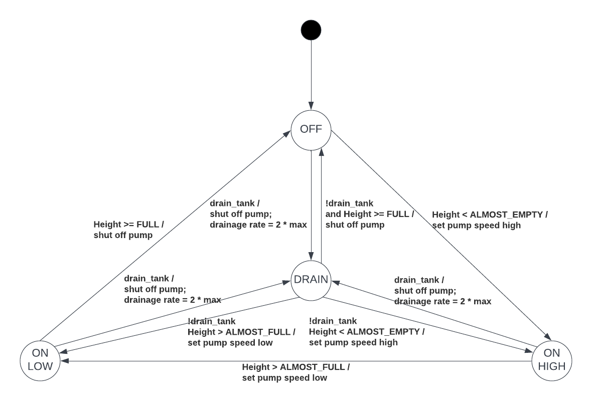

# CEG3136 Lab 2 Report

Group 9:
* Monique Diemert
* Hongyi Lin

***

- [CEG3136 Lab 2 Report](#ceg3136-lab-2-report)
  - [Task 1](#task-1)
  - [Task 2](#task-2)

***

## Task 1

## Task 2

Our code changes to implement the task 2 requirements:
1. Create a global variable `int drain_tank;` to store the user input. `0` means not drain mode, and `1` means drain mode.
2. Add `DRAIN` to `enum pump_States`.
3. Add a parameter to the function `pump_update_state` and `tank_update_height` to indicate whether drain mode is enabled.
4. Implement the drain mode operations and the state transitions in the two functions above.

As shown in the line chart in this section, when the machine entering the drain mode, the tank height drops quickly than before until it reaches 0. When the machine exits the drain mode, it operates as normal.
